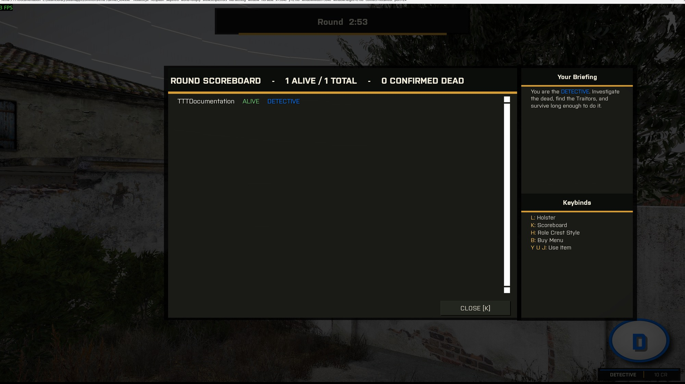

# Investigation Mechanics

## DNA scanner and contamination

Every kill leaves DNA. `Waldo_fnc_onKilled` tags the body and nearby weapon holders with `Waldo_killerDNA`. A Detective's DNA Scanner samples evidence within 4m and tracks the suspect with a distance and bearing update each second.

Two rules keep the scanner uncertain:

- **Decay.** Older samples produce shorter tracks.
- **Contamination.** For 90 seconds after a body or item appears, each different player within 3m can become a witness. Each witness raises the chance that the scanner points to a random living non-culprit. The scanner warns the Detective about contamination but cannot confirm whether a particular reading is true.

The **Enhanced Scanner** halves the misdirection chance, extends the track duration, and adds time-since-death and weapon details when it scans a body.

## Identify Body

Every body has a scroll action that confirms the death to the server. Only a Detective's identification reveals the victim's role through `Waldo_roleRevealed`. A non-Detective can find a body first without consuming the action, so a Detective can still reveal the role later. A Detective's call retires the action and updates the scoreboard's confirmed-dead count.

Each call gives the caller a private notification. Repeating the action on a found body explains that the body already has confirmation. It also explains that the role still needs a Detective.

## Dead Ringer (Traitor)

Dead Ringer arms a 25-second window. The next lethal hit triggers a `HandleDamage` guard instead of killing you. `Waldo_fnc_deadRingerTrigger` makes you ragdoll and blocks damage. It also spawns an Innocent decoy corpse dressed from the spawn-loadout pool. You remain down and vulnerable for 20 seconds.

## False Flag (Traitor)

False Flag makes your next kill leave a random other living player's DNA at the scene (Innocent or Detective - only the culprit's own team is excluded). That kill consumes the item, whether or not the Detective's radar sees it. If no other living player is around to frame, the kill falls back to leaving your own DNA - the item is still consumed either way.

## Body Remover (Traitor)

Body Remover destroys a corpse. The Detective gets no DNA, Identify Body action, or forensic trail.

## Disguiser (Traitor)

Disguiser opens a picker containing the living players visible to you. It copies the chosen player's current loadout for 60 seconds and shows a countdown. During that window, DNA from your kills identifies the copied player. False Flag takes priority when both effects are active. Buying another Disguiser replaces the active window and restores your original loadout.
