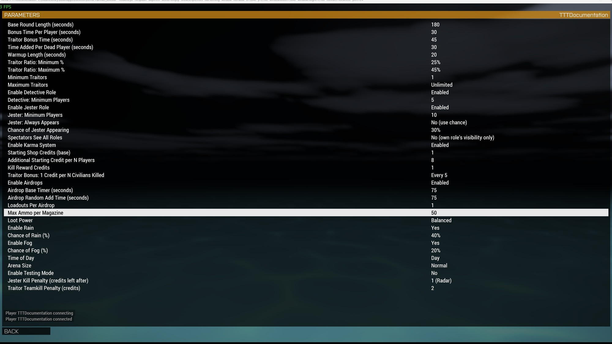

# Lobby Parameters

`Waldo_fnc_loadParams` reads parameters by index in the order declared in `description.ext`'s `class Params`. Append new parameters after the existing list. Inserting or reordering a parameter shifts every later index and invalidates saved lobby presets. The current list uses logical groups, so keep that order deliberately.

## Round

| Parameter | What it controls |
|---|---|
| Base Round Length | The civilian clock's starting point, before any bonuses. |
| Bonus Time Per Player | Added per player to the base length. |
| Traitor Bonus Time | Added on top of the civilian clock to get the hard deadline (`timelimit`). |
| Time Added Per Dead Player | Extends `timelimit` by this much on every death. |
| Warmup Length | Seconds spent on the "Selecting Roles" screen before the round goes live. Can be skipped early from the dev menu. |

## Roles

| Parameter | What it controls |
|---|---|
| Traitor Ratio: Minimum/Maximum % | The two values form the range from which `assignRoles` rolls a Traitor percentage. |
| Minimum/Maximum Traitors | Hard clamps on the rolled count. Max 0 means unlimited. If Max is set below Min, Min wins. |
| Enable Detective Role | Off entirely disables the role. |
| Detective: Minimum Players | Lobby size floor before a Detective is assigned at all. |
| Enable Jester Role | Off entirely disables the role. |
| Jester: Minimum Players | Lobby size floor before a Jester is assigned at all (default 10). |
| Jester: Always Appears | Skips the chance roll and guarantees a Jester, once the minimum-players floor is met. |
| Chance of Jester Appearing | The roll used when "Always Appears" is off. |
| Spectators See All Roles | Off shows a dead player only the roles their living role would reveal, including their team and the public Detective. On reveals every living role. |

## Gameplay / Economy

| Parameter | What it controls |
|---|---|
| Enable Karma System | Toggles the cross-round RDM penalty (see [Architecture](Dev-Architecture)). |
| Starting Shop Credits (base) | Traitor/Detective starting credits, before the per-player scaling below. |
| Additional Starting Credit per N Players | Traitor/Detective starting credits also get +1 for every N players in the lobby (default 8). |
| Kill Reward Credits | Credits paid for a qualifying kill. Set 0 to disable the reward. |
| Traitor Bonus: 1 Credit per N Civilians Killed | Traitors get +1 credit for every N civilian (non-Traitor, non-Jester) kills their team racks up this round - 0 turns it off. |

## Penalties

| Parameter | What it controls |
|---|---|
| Jester Kill Penalty (credits left after) | The number of credits left after a Traitor kills the Jester. It is not a fixed deduction. The default is 1 credit. |
| Traitor Teamkill Penalty (credits) | Credit and karma penalty for a Traitor who kills a teammate. The penalty is smaller than real RDM. |

## Airdrop / loot

| Parameter | What it controls |
|---|---|
| Enable Airdrops | Off stops the round loop from ever calling `spawnAirdrop`. |
| Airdrop Base/Random Timer | The wait between drops is the base time plus a random roll up to this value. |
| Loadouts Per Airdrop | How many weapon loadouts a non-golden crate gets. |
| Max Ammo per Magazine | Ground loot won't include a magazine holding more than this. |
| Loot Power | Low (SMGs/pistols only), Balanced (low-powered, topped up with standard rifles if sparse), or Anything (low and standard mixed unconditionally). |

## Environment

| Parameter | What it controls |
|---|---|
| Enable Rain / Chance of Rain | Whether `setupWeather` can roll rain, and how likely. |
| Enable Fog / Chance of Fog | Same, for fog. |
| Time of Day | Random, Dawn, Day, Dusk, or Night. Each non-random option rolls within that window rather than a fixed hour. |

## Arena

| Parameter | What it controls |
|---|---|
| Arena Size | Small / Normal / Large, a 0.75x / 1x / 1.5x multiplier on the radius `selectArena` computes from player count. |

## Testing

| Parameter | What it controls |
|---|---|
| Enable Testing Mode | Unlocks the dev/test menu (`[`) and the instant role-cycle key (`]`). See [Dev and Test Mode](Dev-Test-Mode). Normal games cannot access either action. |

## A server difficulty setting, not a lobby parameter, that hosts must change

**Kill Messages** must be off in the server's difficulty settings. No lobby parameter or `description.ext` setting can change it. Every player slot uses `side="Civilian"`, so Arma otherwise treats every kill as same-side fire and broadcasts the killer and victim to system chat. Set it before hosting.

## A fixed lobby bug worth knowing about

Every boolean-style parameter uses a numeric `{0,1}` value and compares it with `!= 0`. Arma ignores a bool-typed lobby parameter with a bool default and returns that default regardless of the host's choice. An earlier version used bool defaults for several settings, including Jester and Testing Mode, so their lobby controls did nothing. New on/off parameters must follow the existing numeric pattern.
