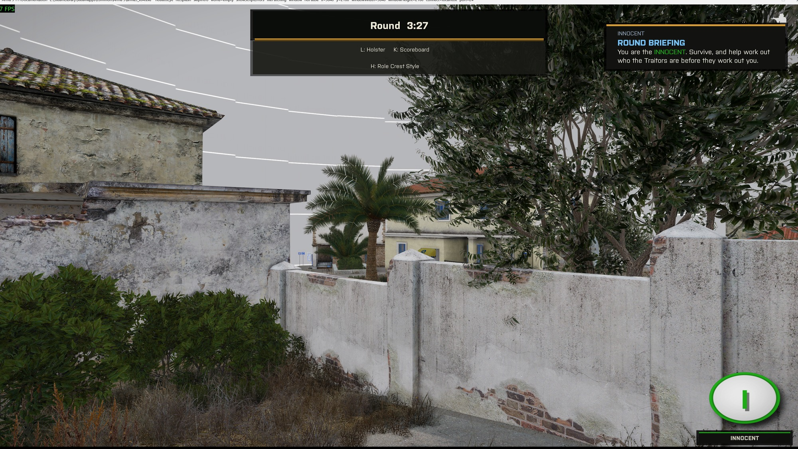
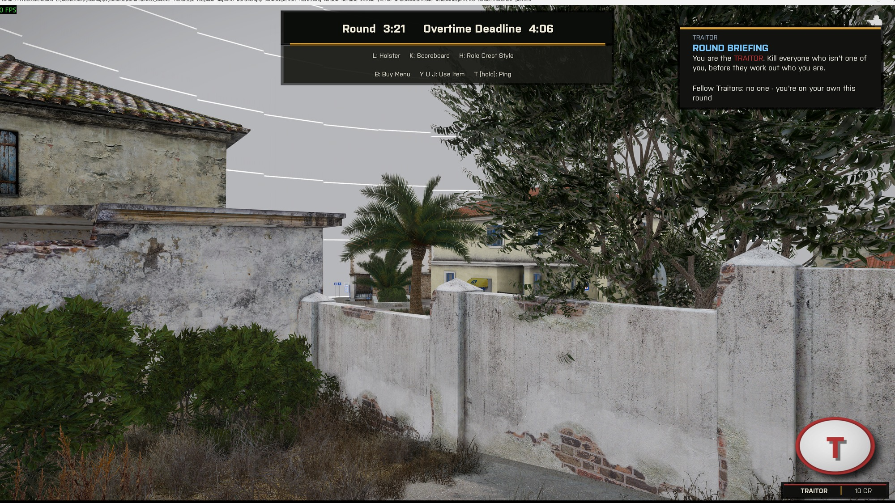
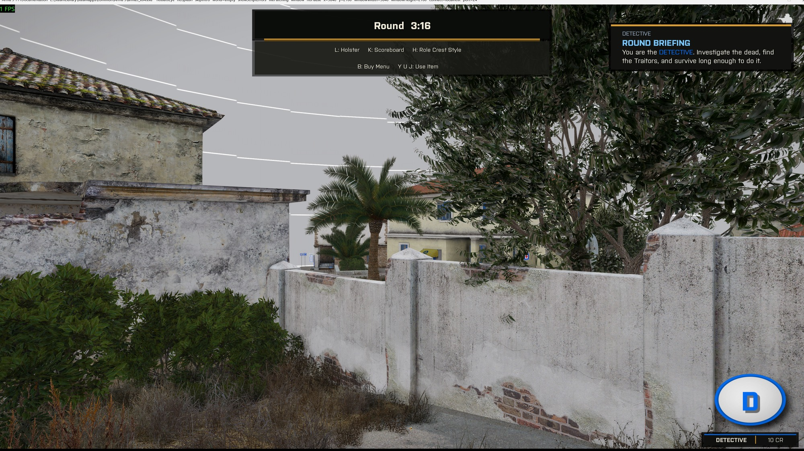
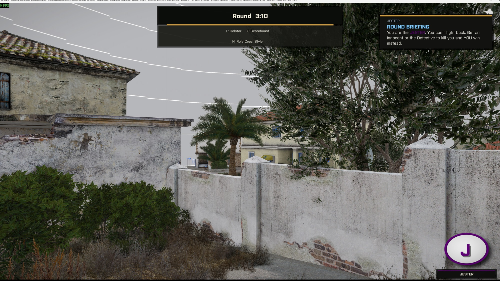

# Roles and Win Conditions

## The four roles

**Innocent.** The majority. Innocents have no special powers and win when every Traitor is dead.

**Traitor.** A hidden minority who know one another. Traitors share a credit shop and win by killing everyone who is not a Traitor.

**Detective.** A public Innocent with an investigation shop for testing, DNA scanning, and radar. Detectives win with the Innocents.

**Jester.** Jesters deal no damage because a `Fired` handler removes their projectiles. A non-Traitor who kills the Jester gives the Jester a solo win. A Traitor kill does nothing for the Jester and costs the Traitor the kill reward.

`Waldo_fnc_assignRoles` resets every player to Innocent, selects Traitors from the configured percentage range, then assigns a Detective and Jester when their settings allow it.

Each player receives a private round-start briefing. Traitors learn their teammates and the Jester. Everyone learns the Detective. Other roles learn only that a Jester exists. The same briefing remains available from the scoreboard's **K** panel. The colourblind setting applies to every role colour.

## How a round ends

`Waldo_fnc_checkWin` checks once per second in this order:

1. **END4, Jester wins.** A non-Traitor killed the Jester this round (`JESTERCLEANKILL`).
2. **END1, Innocents win.** A Traitor side existed and no Traitor remains alive.
3. **END2, Traitors win.** A Traitor side and a non-Traitor side existed, and no non-Traitor remains alive. A living Jester counts as a non-Traitor.
4. **END3, time's up.** The timer reached its limit without another ending. This counts as an Innocent survival.

The team endings require a Traitor side. END2 also requires a non-Traitor side. These guards stop a one-player all-Traitor lobby from winning as soon as the loop starts.

## Round timing

- `Waldo_startTime` is the civilian clock: base length plus player-count bonus.
- `timelimit` is the hard cutoff: `Waldo_startTime` plus the Traitor bonus.

Each death extends `timelimit` by the configured amount. The total extension cannot exceed the Base Round Length.
