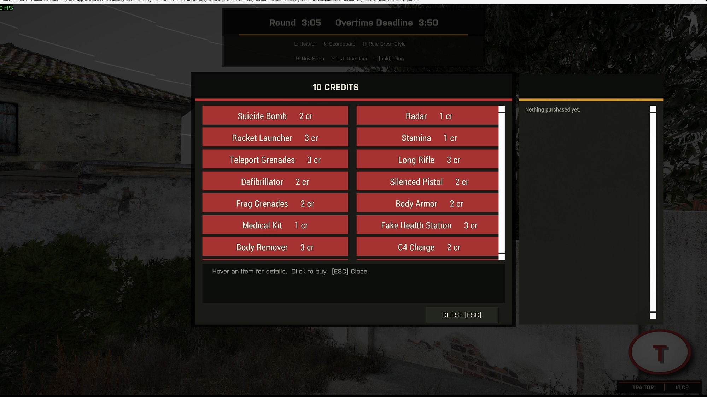
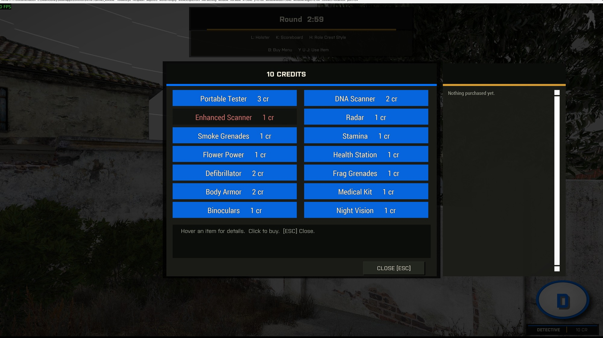

# Shops and Items

Traitors and Detectives each get a shop with roughly fourteen items. Press **B** to open it. `Waldo_fnc_initShops` builds both catalogs at runtime, so adding an item needs one array entry:

```
[ _name, _cost, _type, _onBuy, _onActivate, _tooltip ]
```

- `_type` is `"passive"`, `"weapon"`, or `"activation"`.
- `_onBuy` runs when the player purchases the item.
- `_onActivate` runs when the player presses its **Y**, **U**, or **J** binding. Return `true` to consume the item or `false` to leave it assigned. DNA Scanner and Tester use `false` when the target is invalid.

Activation items use three key slots. The first three purchases bind to Y, U, and J. Later purchases wait in a backlog until you spend an item or reassign one from the Purchased panel.

## Traitor shop

The catalog contains Suicide Bomb, Radar, Rocket Launcher, Stamina, Teleport Grenades, Long Rifle, Defibrillator, and Silenced Pistol. It also contains Frag Grenades, Body Armor, Body Remover, C4 Charge, Night Vision, Dead Ringer, False Flag, and Disguiser.

Radar pulses every player's position and then recharges. Teleport Grenades create red smoke and move you to the landing point. The Defibrillator revives a body onto the Traitor team. Body Remover destroys a corpse and denies the Detective its evidence. Disguiser copies a living player's loadout for 60 seconds and redirects your DNA. See [Investigation Mechanics](Player-Investigation-Mechanics).



## Detective shop

Portable Tester, DNA Scanner, Enhanced Scanner, Radar, Smoke Grenades, Stamina, Flower Power, Health Station, Defibrillator, Frag Grenades, Body Armor, Medical Kit, Binoculars, and Night Vision.

The Portable Tester reveals a role at close range. Enhanced Scanner upgrades the DNA Scanner. Flower Power replaces the round with flowers. The Defibrillator revives a body with its original role.



Both catalogs read weapon and gear classnames from `missionNamespace` at click time. The shop follows the dynamic arsenal instead of hardcoding mod content. See [Equipment System](Dev-Equipment-System).

## The Purchased panel

A second panel lists everything bought this round with its tooltip as a usage reminder (`Waldo_purchases`, reset each round in `assignRoles`). New purchases appear at the top.

Each activation entry shows its current key, `[unassigned]` in the backlog, or `[used]` after spending. Click Y, U, or J to reassign it. The item already using that key moves to the backlog.

## Revive, in more detail

Both defibrillators call `Waldo_fnc_revive`. Arma cannot restore a unit after `damage` reaches 1 and the `Killed` event fires. Respawn creates a new unit object.

The revive flow therefore sets `setPlayerRespawnTime` to 0 and stores the intended role on the corpse. The mission-root `onPlayerRespawn.sqf` hook moves the role, credits, kill count, purchase log, event handlers, and activation state onto the new unit. It also restores a basic loadout and refreshes the HUD. On the server, `Waldo_fnc_reviveRelink` replaces the dead reference in `TraitorList`, `DetectiveList`, or `JesterList`. Win checks and credit awards then use the new unit.
